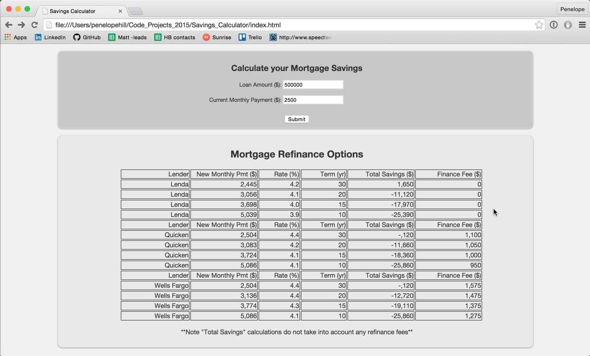

#Savings Calculator
***

####OBJECTIVE: Create a mortage calculator that takes user inputs and calculates refinancing options from various lenders. The rate and term data is accessed via lender APIs. 
 

####TECH STACK: Javascript, CSS, HTML
 
#####TO-DO:
<ul>
<li>write full-coverage tests using Jasmine</li>
</ul>

